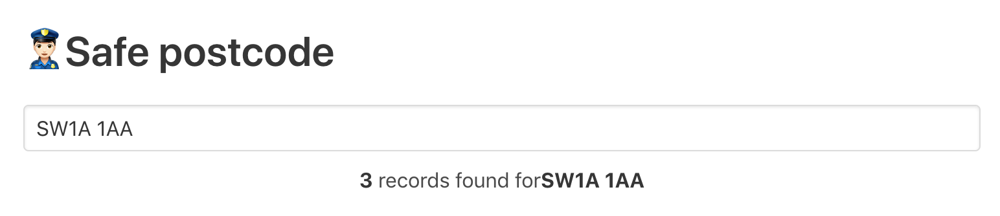

# safePostcode



Safe Postcode is a demonstration of an API integration designed by [@pedsm](https://github.com/pedsm) and [@jonathanballs](https://github.com/jonathanballs) with the intention of making teaching the concept of APIs to programming students.

Safe postcode uses 2 publicaly avaliable APIs in order to fetch crimes reported around a certain area.

1. [Postcodes.io](https://postcodes.io/) a postcode api for the UK
2. [UK Police API](https://data.police.uk/) the UK police open api

## How it works

Safe postcode uses `postcodes.io` in order to fetch the latitude and longitude of a particular postcode

``` bash
http https://postcodes.io/postcodes/SW1A%201AA
```

Then uses the result to create a query to the UK police api

```bash
http https://data.police.uk/api/crimes-at-location\?lat\=51.501009\&lng\=-0.141588
```

This is an intresting way of teaching begginers about what APIs can do in a way that generates something relatable.

## Built with

- [React.js](https://reactjs.org/) - Frontend framework
- [Next.js](https://nextjs.org/) - Server side rendering for React.js
- [Zeit Now](https://zeit.co/now) - Serverless deployment service